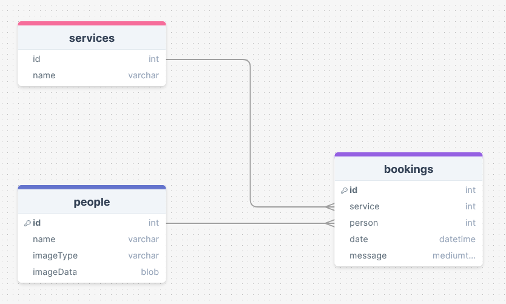
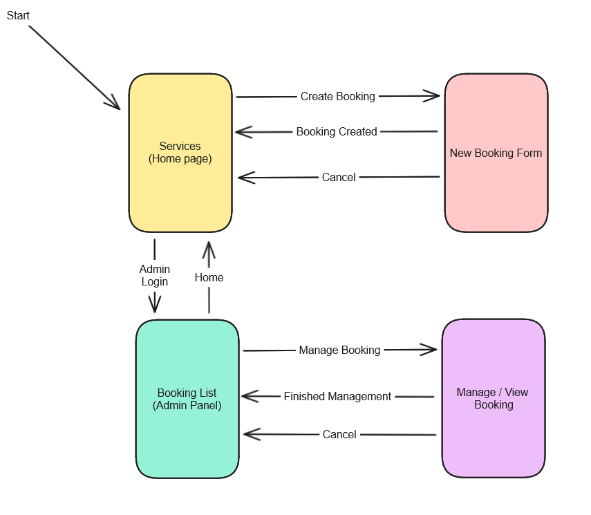
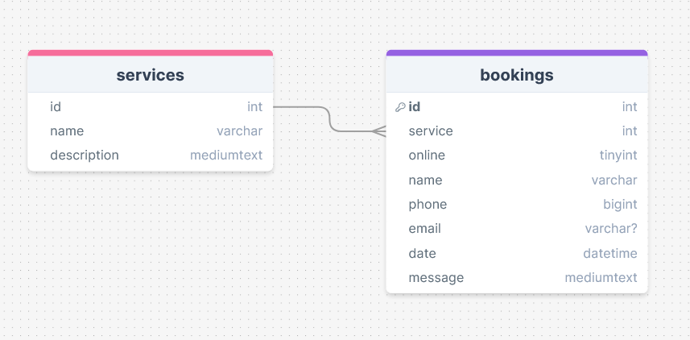
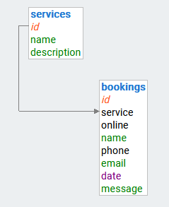
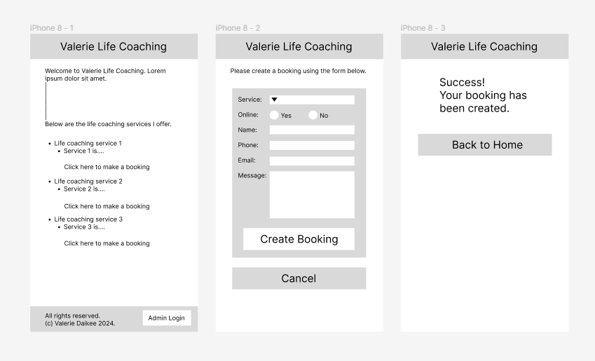
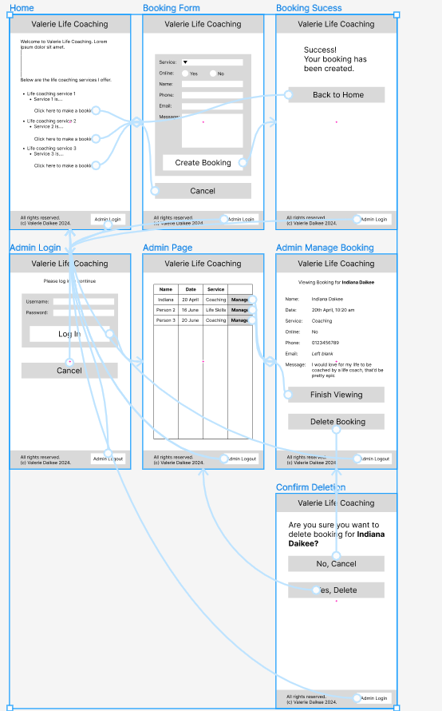

# Development of a Database-Linked Website for NCEA Level 2

Project Name: **Life Coaching Website**

Project Author: **Indiana Daikee**

Assessment Standards: **91892** and **91893**

-------------------------------------------------

## Design, Development and Testing Log

### 2024-05-16

I have created an initial database relation diagram. I will check with my Mum to see what is needed.

Feedback from my Mum:
> There is no need to store a list of people; having a person's name and email address in the booking form is enough. Wouldn't that also mean people would have to make a profile first in order to book something? I don't want that.

### 2024-05-21

I have created a flow diagram showing how users would interact with the website:

I have also created a new database relation diagram based on my Mum's feedback - she said she doesn't want any sort of account system. As such the updated diagram is below:

Feedback from my Mum on the new database relation diagram
> This new database layout makes more sense.

As such I have made this database in Adminer:

### 2024-05-23

I am working on a black and white website mock-up on Figma that to show to my Mum.

So far I have made a very rough mock-up of the public half of the website. 

Once I get the admin side of the website set up I will show my Mum what she thinks.

### 2024-05-27

I am working on the admin console for the Figma mock-up.

I have completed the interactive figma mock-up:

I get my Mum to interactively test it out and get feedback from her.

### DATE HERE

Replace this test with what you are working on

Replace this text with brief notes describing what you worked on, any decisions you made, any changes to designs, etc. Add screenshots / links to other media to illustrate your notes where necessary.

### DATE HERE

Replace this test with what you are working on

Replace this text with brief notes describing what you worked on, any decisions you made, any changes to designs, etc. Add screenshots / links to other media to illustrate your notes where necessary.

### DATE HERE

Replace this test with what you are working on

Replace this text with brief notes describing what you worked on, any decisions you made, any changes to designs, etc. Add screenshots / links to other media to illustrate your notes where necessary.

### DATE HERE

Replace this test with what you are working on

Replace this text with brief notes describing what you worked on, any decisions you made, any changes to designs, etc. Add screenshots / links to other media to illustrate your notes where necessary.