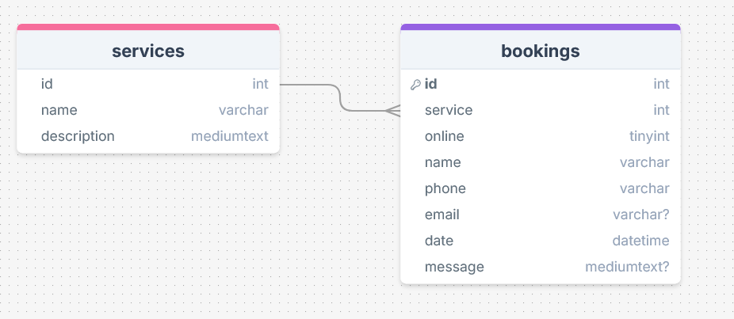
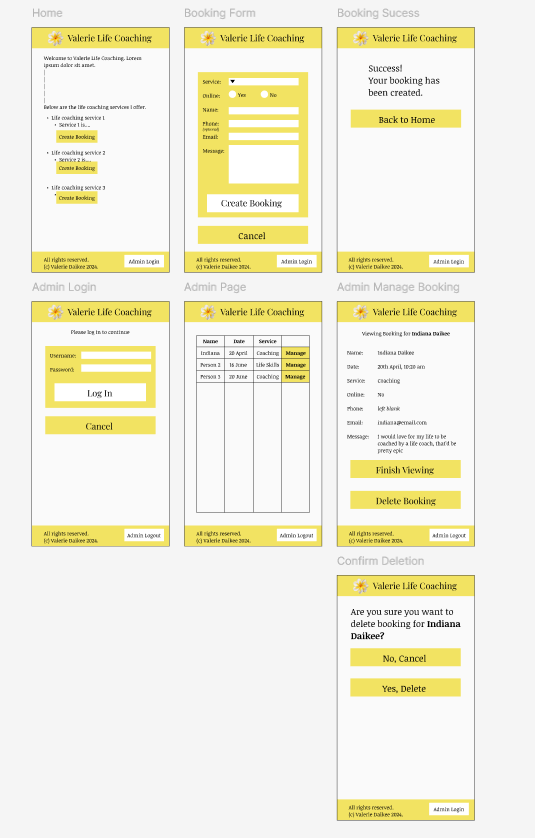
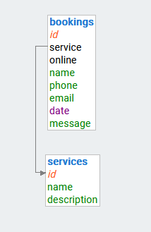
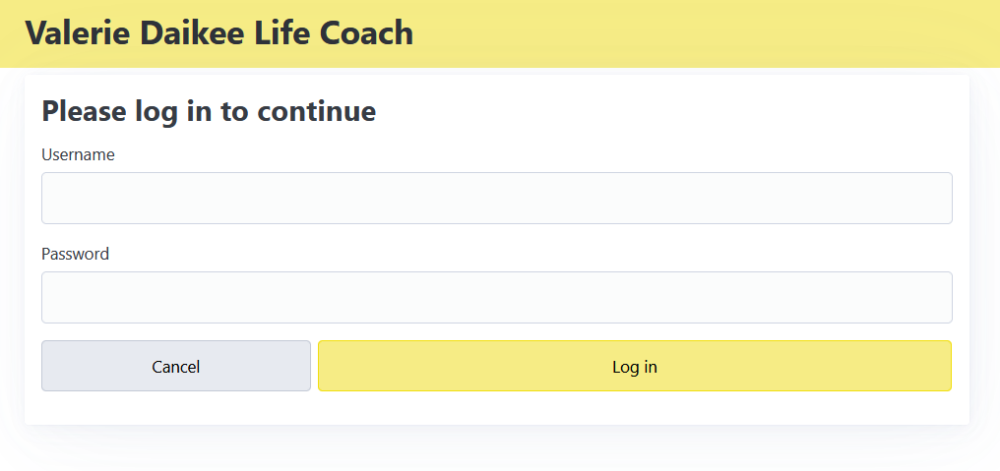

# Design of a Database-Linked Website for NCEA Level 2

Project Name: **Life Coaching Website**

Project Author: **Indiana Daikee**

Assessment Standards: **91892** and **91893**

-------------------------------------------------

## System Requirements

### Identified Need or Problem

My Mum needs a website for her life coaching business to both allow people to make bookings and to make it easier for her to manage these bookings.

### End-User Requirements

I have two end user groups: members of the public and my Mum. Requirements for members of the public include:
- A page listing my Mum's different services
- A page for creating a booking
- Attractive, aesthetically pleasing website
- Suitable level of language (i.e. not too advanced or basic)

Requirements for my Mum include:
- Interface to view and manage bookings
- Simple and easy to use interface
- Foolproof

### Proposed Solution

My solution is to create a website that allows members from the public to read about my mum's business and make bookings. It would also have a way for my mum to log in and manage (view and delete) these bookings.

-------------------------------------------------

## Relevant Implications

### Aesthetics

Aesthetics involves ensuring that a design looks good, appeals to the target audience and follows design conventions.

My website needs to look good in order to appeal to the public - it's well known that a prettier website improves public interaction. It is important that my design doesn't get in the way of established conventions however...

I will need to consider my choice of colour scheme, font, and element positioning. I will need to ensure that whenever I make design choices on the public part of the website I get feedback fom members of the public. I will also need to consider that my design is accessible to all people, which will affect my design choices.

### Accessibility

Accessibility is making sure everyone can use a website, no matter their device, disabilities, or technical expertise.

It's vital that *anyone* using my website is able to do so easily - every member of the public is a potential customer and having people be turned away because they aren't able to interact with my website (e.g. because they are colour-blind and can't read red text on green) would not only be bad for my Mum's business, but also verging on discriminatory - everyone should to be able to use my website.

To make my website accessible to all I will need to ensure that my website works on all devices and screen sizes - this may look like responsive design and/or a separate layout for mobile devices. I will also need to make sure the content of my website is able to be viewed and interacted with by everyone. This will include
- Selecting a good colour scheme to ensure that people with colour-blindness or impaired vision can read the text,
- Selecting a readable font and font size to make it readable on any device,
- Providing alt text for images to ensure that users with a screen reader can interact properly,
- Making UI components like buttons appropriately sized and easily clickable on all devices and screen sizes.

### Functionality

Functionality is ensuring a website works as intended, as expected, and well.

A functional design is very important for both the public and admin sides of the website - the public are going to expect it to work as expected from their point of view, without bugs and issues; if there are any bugs then they are unlikely to use the website and consequentially my mum's services. My mum also needs a functional admin interface in order to effectively manage bookings, and this certainly needs to be bug free and work as expected else she will freak out.

I'll need to get feedback and testing from both my mum and members of the public to make sure my website works as they expect it to. Once I implement this feedback, I'll need to get more updated feedback from both parties, and continue this cycle until I have a final design. Once I reach this final design stage, I will need to evaluate the functionality of this design against my original design. This will ensure the website is logical and bug-free.

### Usability

A website's usability relates to how easy and logical it is for the end-user to use without being guided.

It's important that my end users find navigating and operating the website to be an easy task for similar reasons as above - end-users will expect the website to follow established conventions (as established by Nielsen's usability heuristics), and if the website for whatever reason doesn't, these potential customers are likely to take this as a sign of unprofessionalism and find another life coach - meaning my Mum will lose a customer.\
My Mum also needs the admin side of the website to have a high degree of usability - she needs to be able to easily manage bookings without hassle - she wants the website to * just work*.

In order to make my website as usable as possible, I will need to make sure my website follows Nielsen's usability heuristics. This will include:
- Consistency and Standards: I will need to make sure my website sticks to established layout conventions, such as having the navigation bar at the top and using standard icons, such as using a house icon for the home page. This will make navigation easy.
- Error Prevention: I will need to make sure that wherever users can input data that there is error checking to prevent users from inputting incorrect data, e.g. they shouldn't be able to input a date that doesn't exist. This will prevent end-users from making headache-inducing mistakes. This also entails having conformation messages before users commit to an irreversible action, and by integrating these into my website will ensure my Mum doesn't accidentally delete any bookings.
- Aesthetic and Minimalist Design: By making sure both the public and admin sides of my website have a simple design that displays only what is relevant and necessary, both the public and my Mum will have an easier time navigating and operating the website.
- Help and Documentation: If necessary, I will have a help menu to answer the any questions that members of the public may have (e.g. *how do I make a booking?*). This may be in the form of a sticky question mark button in the corner of the site, but I will get feedback on what works best. I may also implement a similar system on the admin page(s) can help my Mum if she gets confused. Ideally, though, my website will be simple and logical enough that end-users shouldn't need help.

### Privacy

Privacy is about protecting end-users and keeping their data secure and private.

It's vital that the privacy of end-users is protected; this website is for a life coaching business where members of the public may disclose personal information. Aside from the ethical implications of storing sensitive data, abiding by the NZ Privacy Act 1993 is required by law, so it's vital that this system follows abides by that.

My Mum doesn't need a whole lot of information about her clients; the only (potentially) sensitive info being stored would be a few short, optional sentence that customers can fill out. However, this information is identifiable by name, and if it isn't securely and private, this would be a breach of the NZ Privacy Act 1993. On my website this wil look like making sure the admin page is password-protected and also having a privacy statement on what data is being collected.

-------------------------------------------------

## Final System Design

### Database Structure

### User Interface Design

-------------------------------------------------

## Completed System

### Database Structure

### User Interface Design

-------------------------------------------------

## Review and Evaluation

### Meeting the Needs of the Users

Replace this text with a brief evaluation of how well you met the needs of your users. Look at what you initially wrote about who they are, what specific needs they have, etc. and discuss how well the system meets those needs.

I have user groups for this website: My mum, and the public. The needs I originally identified for the public were:
- A page listing my Mum's different services
- A page for creating a booking
- Attractive, aesthetically pleasing website
- Suitable level of language (i.e. not too advanced or basic)

These needs have been met by the website. The first two are obvious - that's basic functionality which it is trivial to see my website has. By using and building on top of PicoCSS, an elegant, attractive CSS framework, my website is very aesthetically appealing - this is discussed further below on the "Review of Aesthetics" section. I have ensured the level of languge complexity used on the website is right for the my Mum's target demographic - not too simple or complex - and feedback from the public has confirmed this:
> I think it's easy to tell what's going on - it's clear who Valerie is and what her services are.

The needs identified for my Mum were:
- Interface to view and manage bookings
- Simple and easy to use interface
- Foolproof

Through lots of back and forth feedback through the process of iterative design, my Mum is very happy with the admin panel. It allows her to do all she needs to do, is simple enough for her to be able to use without a hitch, and it has error prevention to prevent accidental mistakes or misclicks from having any repercussions.

### Meeting the System Requirements

Replace this text with a brief evaluation of how well you met the requirements that you defined at the start of the project, etc. Look back at the list of features / functionality you initially set and discuss how well your system has implemented each one.

The idenfified requirements at the start were:
- Database-connected website
- Has information about the business
- Allows members of the public to create bookings for different services
- Allows admins to view and manage bookings

This was a high-level overview of what I needed the website to do, and it has met all these requirements well. This can be seen in the video above.

### Review of Aesthetics

After getting lots of feedback from both the public and my Mum, and after plenty of design iteration right from the very first sketches, my website is now optimally aesthetically pleasing:
> Love the colours.
> The website looks clean, I like it.
> [My mum] said she likes the new yellow colour.

### Review of Accessibility

After doing lots of testing, including getting members of the public to test the site, I can safely say that the website is accessible to all people. This testing has involved
- HTML and CSS validation to ensure people on any (remotely modern) browser will be able to view and use the site properly
- Contrast validation
- Alt text on images, and correct form labels

Other miscellaneous accessiblity testing included:
- Confirmation of readability from colour-blind people (i.e. my Dad)
- Testing on various mobile devices
- Testing of many different screen sizes with the developer tools
- Ensuring dark mode doesn't break the contrast
- Having my Dad, who is red-green colourblind (deuteranomaly), confirm that the website is useable. It would be better if I had someone that was blue-yellow colourblind to test the website, as yellow features heavily, but I really can't see this being a problem, given that there is literally no blue on the website whatsoever. In fact, colour doesn't really play a part on this website at all - colour is only there to make it look nice, and doesn't serve and indicitive purpose - if all colour was removed so the website was entirely greyscale, it would still be fully useable, for example, with these radio buttons,

it is still possible to see which is selected even in the absence of colour, due to the black selection indicator:

### Review of Functionality

To make the website work as intended and expected from the points of view of both my mum and the public, I got lots of feedback from both parties. Throughout the iterative process there were many things identified that weren't logical or expected, for example:
- The header not being a link
- Dates using the ISO format instead of the standard date format used in NZ
- There being no indication of whether a confirmation email will be sent

All of these issues (and many more) were adressed. A thourough scan of all functionality of the website was done to ensure there were no bugs.

This proper, intended, expected, and bug-free functionality can be seen in the video above.

### Review of Usability

I designed this website to be as easy to use as possible, and the main way of doing this was obeying Nielsen's usability heuristics:
- Consistency and Standards: People expect the site to act like most other websites, and as such I've followed the expected conventions, such as having the header be a link to the main page of the website: 
- Error prevention: Users can be irrational - this could include trying to input date that don't exist, forgetting to include a name, accidentally deleting an important booking, etc. I have added multiple forms of error prevention to counter this - on the public booking creation page, I have made sure that incorrect types of data cannot be entered - for example, the user cannot 'Dave' in the booking date field. On the admin side, I have added confirmation for when my Mum tries to delete a booking, ensuring she doesn't accidentally delete anything important.
- Aesthetic and Minimalist Design: As written in review of accessibility (above), the website has an aesthetically pleasing, minimalist design. Aside from the benefits of a good looking design (above), by having a minimalistic interface I have ensured that only relevant information is displayed, giving both the public and my mum an easier time navigating - especially if they aren't tech-savvy. This can be seen in the video above.
- Help and Documentation: By having a very simple design, feedback from the public determined that I don't need and help menu - everything is logical, even for someone that has very poor computer skills. My Mum also found the admin panel easy to use - she said herself that I've left no room for confusion.

### Review of Privacy

To ensure the privacy of my Mum's clients, I have implemented an admin panel that is locked behind both a username and password that only my mum knows:

This is enough security to not be in breach of the NZ Privacy Act 1993. The only data that is collected is what the user submits, so no privacy statement is required.