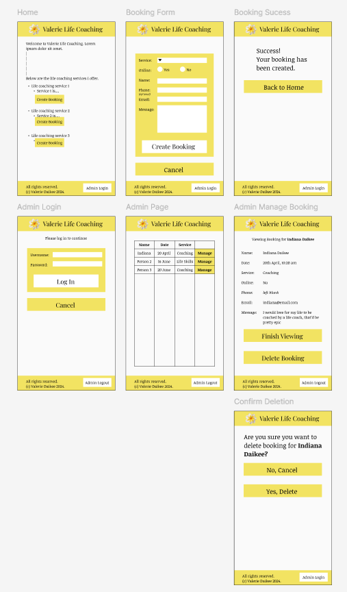
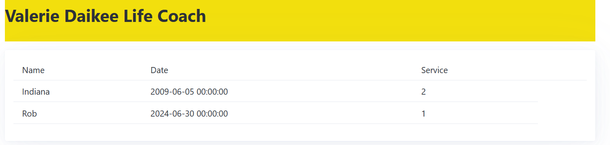

# Development of a Database-Linked Website for NCEA Level 2

Project Name: **Life Coaching Website**

Project Author: **Indiana Daikee**

Assessment Standards: **91892** and **91893**


-------------------------------------------------

## Design, Development and Testing Log

### 2024-05-16

I have created an initial database relation diagram. I will check with my Mum to see what is needed.


Feedback from my Mum:
> There is no need to store a list of people; having a person's name and email address in the booking form is enough. Wouldn't that also mean people would have to make a profile first in order to book something? I don't want that.

### 2024-05-21

I have created a flow diagram showing how users would interact with the website:


I have also created a new database relation diagram based on my Mum's feedback - she said she doesn't want any sort of account system. As such the updated diagram is below:


Feedback from my Mum on the new database relation diagram
> This new database layout makes more sense.

As such I have made this database in Adminer:


### 2024-05-23

I am working on a black and white website mock-up on Figma that to show to my Mum.

So far I have made a very rough mock-up of the public half of the website. 


Once I get the admin side of the website set up I will show my Mum what she thinks.

### 2024-05-27

I am working on the admin console for the Figma mock-up.

I have completed the interactive figma mock-up:


I will get my Mum to interactively test it out and get feedback from her.

> The general layout was quite intuitive. From this mock website I only have minor critiques:
>- The 'create booking' text should be a button instead of a text link.
>- When creating a booking, an Email should be required but a phone number optional.
>- If the user selects 'No' to the 'Online' section, there needs to be a text box for where they want to meet.

### 2024-05-30

I have made the appropriate changes to cater to my Mum's above requests.


I sat down with my Mum on Realtime Colours and she decided on the following colour palette and fonts, though she said she will have to see it on the actual website mockup and go from there.


### 2024-06-10

I have put the above colours and fonts into the figma website mockup. I will get feedback.


Feedback from my Mum:
>- The fonts seem right; they are easy to read.
>- The yellow is the wrong shade. It needs to be stronger. 
>- I'd like a flower next to my name at the top.
>- I'd like to see what it looks like if all the yellow sections had black outlines.
>- On second thought I don't want a location input box when people go to create a booking.

### 2024-06-11

I will act on my Mum's feedback, making a separate version for the experimental black outlined version.

It will be important to refer back to the legality implication when choosing my flower photo to ensure I stick within any licenses. For experimental testing purposes, though, I have chosen a free image whose license states that I must attribute the website it came from, www.freepik.com. I will use this image for testing, ensuring I provide attribution, but for the finished product I may design my own image or find another with a royalty free licence.

Below is the updated figma design based on my mum's feedback:

Without lines:



With lines:


Feedback from my Mum:
>- I want the name of this website to be "Valerie Daikee Life Coach" or "Valerie Daikee Empowerment Life Coach", whichever fits best"
>- I think there's too much yellow. Maybe yellow could be used as more of an accent colour, with maybe a light shade of grey to differentiate boxes / sections.
>- I definitely prefer the non-outlined version, but I like how it highlights boxes. Maybe there is a way to get the best of both worlds.

The next mockup I give my Mum will be the MVP of a website.

### 2024-06-20

I have started work on my website:


Replace this text with brief notes describing what you worked on, any decisions you made, any changes to designs, etc. Add screenshots / links to other media to illustrate your notes where necessary.

### 2024-06-27

I am continuing work on the website.

I have created an admin login panel. This is suitable for demonstrating the website's functionality to my Mum, but it is a big security concern - I am simply using a form and PHP code to check if the user's credentials are correct. I will have to change this later though, as due to the possibly sensitive data being stored, having the admin panel this easy to breach would be a violation of the Privacy Act, which states that I must ensure that this data is secure.

I have got my database working with the site - creating a booking adds an entry to the bookings table:


...and you can see these booking on the admin page:

However it can be seen that it displays the service id number instead of the service name. I will have to use SQL to join these databases together. 

After some clever SQL work:
```
$query = 'SELECT bookings.name AS `Bname`,
                 `date`,
                 services.name AS `Sname`,
                 bookings.id `BID`
          FROM bookings
          JOIN services ON bookings.service=services.id
          ORDER BY `date`';
```

The result is clear.

### DATE HERE

Replace this test with what you are working on

Replace this text with brief notes describing what you worked on, any decisions you made, any changes to designs, etc. Add screenshots / links to other media to illustrate your notes where necessary.

### DATE HERE

Replace this test with what you are working on

Replace this text with brief notes describing what you worked on, any decisions you made, any changes to designs, etc. Add screenshots / links to other media to illustrate your notes where necessary.