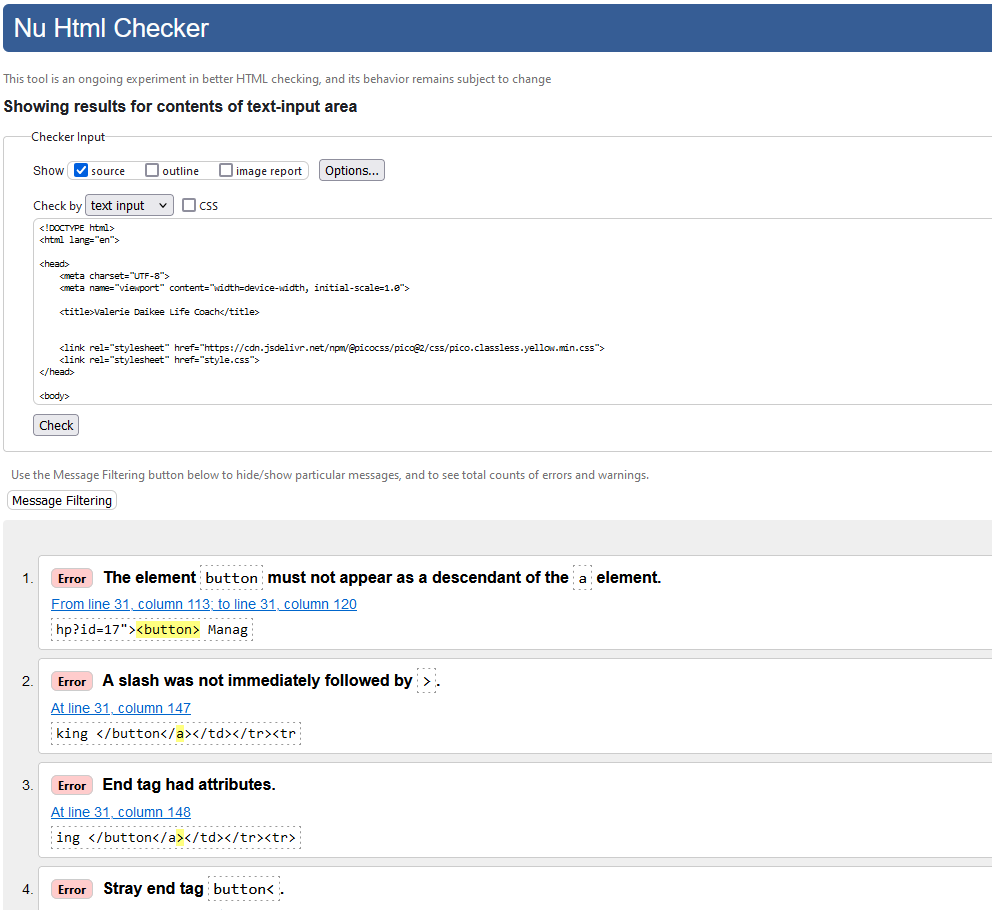

# Development of a Database-Linked Website for NCEA Level 2

Project Name: **Life Coaching Website**

Project Author: **Indiana Daikee**

Assessment Standards: **91892** and **91893**


-------------------------------------------------

## Design, Development and Testing Log

### 2024-05-16

I have created an initial database relation diagram. I will check with my Mum to see what is needed.


Feedback from my Mum:
> There is no need to store a list of people; having a person's name and email address in the booking form is enough. Wouldn't that also mean people would have to make a profile first in order to book something? I don't want that.

### 2024-05-21

I have created a flow diagram showing how users would interact with the website:


I have also created a new database relation diagram based on my Mum's feedback - she said she doesn't want any sort of account system. As such the updated diagram is below:


Feedback from my Mum on the new database relation diagram
> This new database layout makes more sense.

As such I have made this database in Adminer:


### 2024-05-23

I am working on a black and white website mock-up on Figma that to show to my Mum.

So far I have made a very rough mock-up of the public half of the website. 


Once I get the admin side of the website set up I will show my Mum what she thinks.

### 2024-05-27

I am working on the admin console for the Figma mock-up.

I have completed the interactive figma mock-up:


I will get my Mum to interactively test it out and get feedback from her.

> The general layout was quite intuitive. From this mock website I only have minor critiques:
>- The 'create booking' text should be a button instead of a text link.
>- When creating a booking, an Email should be required but a phone number optional.
>- If the user selects 'No' to the 'Online' section, there needs to be a text box for where they want to meet.

### 2024-05-30

I have made the appropriate changes to cater to my Mum's above requests.


I sat down with my Mum on Realtime Colours and she decided on the following colour palette and fonts, though she said she will have to see it on the actual website mockup and go from there.


### 2024-06-10

I have put the above colours and fonts into the figma website mockup. I will get feedback.


Feedback from my Mum:
>- The fonts seem right; they are easy to read.
>- The yellow is the wrong shade. It needs to be stronger. 
>- I'd like a flower next to my name at the top.
>- I'd like to see what it looks like if all the yellow sections had black outlines.
>- On second thought I don't want a location input box when people go to create a booking.

### 2024-06-11

I will act on my Mum's feedback, making a separate version for the experimental black outlined version.

It will be important to refer back to the legality implication when choosing my flower photo to ensure I stick within any licenses. For experimental testing purposes, though, I have chosen a free image whose license states that I must attribute the website it came from, www.freepik.com. I will use this image for testing, ensuring I provide attribution, but for the finished product I may design my own image or find another with a royalty free licence.

Below is the updated figma design based on my mum's feedback:

Without lines:


With lines:


Feedback from my Mum:
>- I want the name of this website to be "Valerie Daikee Life Coach" or "Valerie Daikee Empowerment Life Coach", whichever fits best"
>- I think there's too much yellow. Maybe yellow could be used as more of an accent colour, with maybe a light shade of grey to differentiate boxes / sections.
>- I definitely prefer the non-outlined version, but I like how it highlights boxes. Maybe there is a way to get the best of both worlds.

The next mockup I give my Mum will be the MVP of a website.

### 2024-06-20

I have started work on my website:


Replace this text with brief notes describing what you worked on, any decisions you made, any changes to designs, etc. Add screenshots / links to other media to illustrate your notes where necessary.

### 2024-06-27

I am continuing work on the website.

I have created an admin login panel. This is suitable for demonstrating the website's functionality to my Mum, but it is a big security concern - I am simply using a form and PHP code to check if the user's credentials are correct. I will have to change this later though, as due to the possibly sensitive data being stored, having the admin panel this easy to breach would be a violation of the Privacy Act, which states that I must ensure that this data is secure.

I have got my database working with the site - creating a booking adds an entry to the bookings table:


...and you can see these booking on the admin page:

However it can be seen that it displays the service id number instead of the service name. I will have to use SQL to join these databases together. 

After some clever SQL work:
```
$query = 'SELECT bookings.name AS `Bname`,
                 `date`,
                 services.name AS `Sname`,
                 bookings.id `BID`
          FROM bookings
          JOIN services ON bookings.service=services.id
          ORDER BY `date`';
```

The result is clear.


### 2024-07-02

I have made the interface for managing / viewing a specific booking. It isn't fully polished yet; for example it says 0/1 instead of Yes/No for the 'Online' row.


I have added some extra code in my footer partial that makes the 'Admin Login' button an 'Admin Logout' button if the user is on an admin page of the website.


In order to make my website accessible on all devices, I will use media queries to scale the delete / go back buttons.


### 2024-07-23

I'm at the stage where I can show my mum, and perhaps some members of the public my website. I'm currently polishing the design up, for example having the cancel button for various actions be grey and next to the continue / go button, which lines up with established design conventions, contributing toward the aesthetics and usability relevant implications.


I have also made it so the fields my mum said could be left blank are actually optional, and won't break the database:


### 2024-07-25

I have made some more aesthetic changes to increase the usability of the website:
- Everywhere the user is presented with a choice (i.e. two buttons), I have made the buttons be in line with each other.
- Important actions with consequences (e.g. deleting a booking) have been made red to highlight the possible danger of said action (in my Mum's case, losing money because a booking got cancelled.) This is an application of the "Error Prevention" usability heuristics - it prevents users from making mistakes, as well as the "Match Between System and the Real World" heuristic - red is a colour associated with danger.
- Important actions with consequences also have a conformation page to prevent my Mum's accidental mis-clicks from costing her business money - a prime example of the Error Prevention heuristic


My next stage will be getting feedback from my mum.

### 2024-07-28

I showed my Mum the website. She had a fair bit of feedback for me:

- [x] If I get the admin password wrong it should tell be instead of sending me back
- [x] When viewing a booking I want it to say "In Person" or "Online", not "Online: 0" or "Online: 1"
- [] I'd like bookings to be deleted once they pass their date
- [x] That horrible yellow bar at the top needs to go across the entire screen
- [x] Replace the yellow with that colour I chose (#f6ec85)

I also asked her if she wanted to be able to sort booking by anything other than date. She said no. I may still add a thing that lets her reverse the sort order as I know she will probably use that.


<!-- FEEDBACK : NOT RADIO BUTTONS BUT SELECTY BUTTONS

WHAT IF THERE'S NO BOOKINGS!!!
DIFFERENT COLOUR IF THEY'VE ALRRADY HAPPENED
SORTING BY X Y Z
CONFORMATION WHEN I DO SOMETINH! OR WHEN USE DOES A CREATE A BOOKNG -->

### 2024-07-29

I have been acting on my Mum's feedback, adding what she said would be good.

I have also been making the text on the website far easier to update - for example when my Mum wants to change the name of a service, she can simply change it (or get me to change it...) in the database. This is due to my use of php definitions:
```html
<article>
    <h3><?= SERVICE_1 ?></h3>
    <p><?= SERVICE_1_DESCRIPTION ?></p>
    <a href="form-booking.php?service=service1"><button>Create Booking</button></a>
</article>
<article>
<h3><?= SERVICE_2 ?></h3>
    <p><?= SERVICE_2_DESCRIPTION ?></p>
    <a href="form-booking.php?service=service2"><button>Create Booking</button></a>
</article>
<article>
    <h3><?= SERVICE_3 ?></h3>
    <p><?= SERVICE_3_DESCRIPTION ?></p>
    <a href="form-booking.php?service=service3"><button>Create Booking</button></a>
</article>
```

```php
define('SERVICE_1', $services[0]['name']);
define('SERVICE_2', $services[1]['name']);
define('SERVICE_3', $services[2]['name']);

define('SERVICE_1_DESCRIPTION', $services[0]['description']);
define('SERVICE_2_DESCRIPTION', $services[1]['description']);
define('SERVICE_3_DESCRIPTION', $services[2]['description']);
```

### 2024-08-01

I showed my Mum the changes I made based on her feedback. She is very happy with how the website is progressing, and she had some more changes to me made:
- [x] I would prefer if the circular buttons (radio buttons) were square like the buttons below (the square cancel / add buttons)
- [] I would like a frangipani flower as my logo

### 2024-08-08

My website is nearing being finished. Keeping in line with both best practice and my identified requirement of accessibility, I have started putting all my HTML code through a validator. I will do this again once the site is 100% finished, but it's important to iron out most of the bugs now. This is important - just because my browser on my machine can compensate for my improper code, someone on a older device using a less advanced browser may not be able to view the site.

There were quite a few errors across all the pages:

However I have fixed all of them (for now).


### 2024-08-11

I got some feedback from members of the public. It exposed a few flaws (some that you'd think would be obvious) that neither me nor my Mum could see:
- [] There should be some image on the home page somewhere so I know who Valerie is
- [x] There needs to be some confirmation thing so I actually know the booking has gone through
- [x] Why isn't the header a link?
- [x] If I don't know if this is going to cost me, why would I create a booking?

My Mum said that it would be best for her to simply send the confirmation email herself, with details personalised to that person's individual booking. As she said she may like to vary the payment cost depending on people's situations (e.g. if they're struggling with money), I have added a line that says that "Valerie will send an email confirming your booking details shortly. Payment will be discussed further over email or phone".

### 2024-08-12

I got some semi-final feedback from my Mum. She is very happy with how the website is coming along, and she finds the admin panel quite easy and intuitive to use. She had some minor suggestions, though:
- [x] On the booking page, the date format is DD/MM/YYYY, but on the booking page it is YYYY-MM-DD 0:00:00. These zeroes add clutter and the date format is confusing - it's the wrong way around!
- [] Part of the message seems to get cut off.

Upon investigation, it appears that the message on the view bookings page was getting cut off after 48 characters:

This is because I copied the echo statements from the overview page, where I was using the substr() function to ensure nothing overflowed:
```php
echo    substr($booking['Sname'],0,48);
```
However we certainly don't what names and messages getting cut off on the actual page. As such, I have updated the code:
// Phone number set to text not int; access